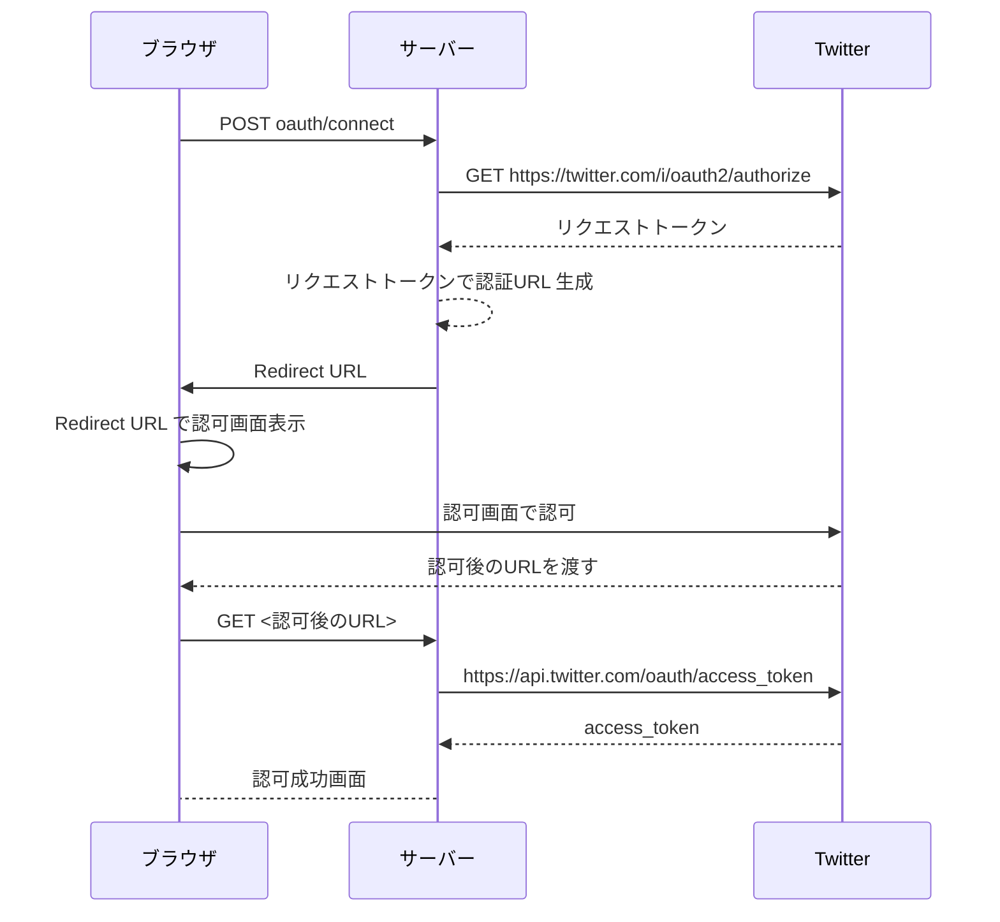

```mermaid
sequenceDiagram
participant c as ブラウザ
participant s as サーバー
participant t as Twitter
    c->>s: POST oauth/connect
    s->>t: GET https://twitter.com/i/oauth2/authorize
    t-->>s: リクエストトークン
    s-->>s: リクエストトークンで認証URL 生成
    s->>c: Redirect URL
    c->>c: Redirect URL で認可画面表示
    c->>t: 認可画面で認可
    t-->>c: 認可後のURLを渡す
    c->>s: GET <認可後のURL>
    s->>t: https://api.twitter.com/oauth/access_token
    t-->>s: access_token
    s-->c: 認可成功画面
```
