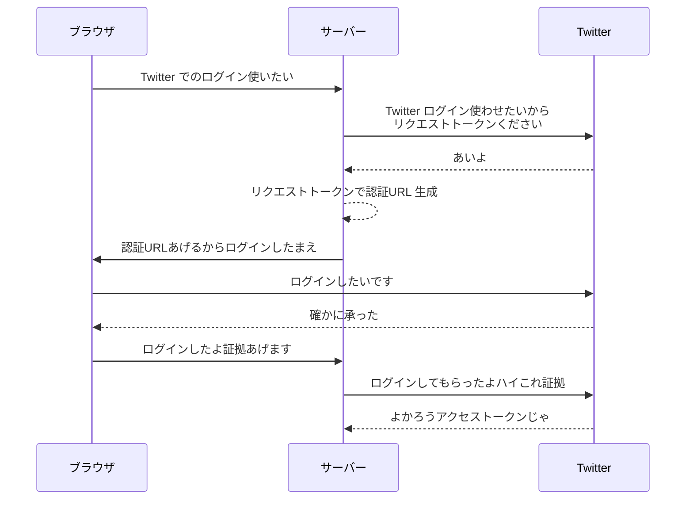

```mermaid
sequenceDiagram
participant c as ブラウザ
participant s as サーバー
participant t as Twitter
    c->>s: Twitter でのログイン使いたい
    s->>t: Twitter ログイン使わせたいから<br>リクエストトークンください
    t-->>s: あいよ
    s-->>s: リクエストトークンで認証URL 生成
    s->>c: 認証URLあげるからログインしたまえ
    c->>t: ログインしたいです
    t-->>c: 確かに承った
    c->>s: ログインしたよ証拠あげます
    s->>t: ログインしてもらったよハイこれ証拠
    t-->>s: よかろうアクセストークンじゃ
``` 